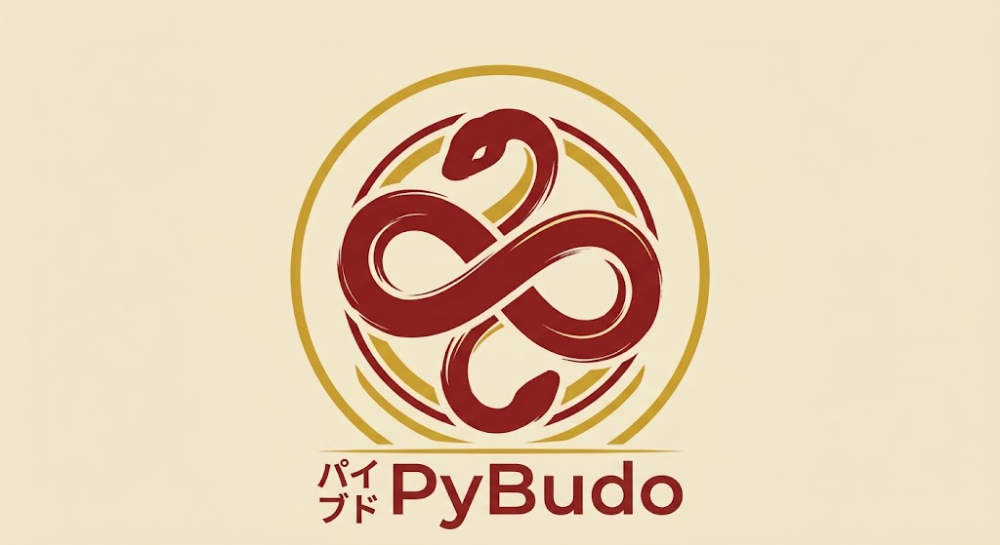

  

<h1 align="center">PyBudo</h1>

  <em>Master Python through practice, not shortcuts.</em>

# pyBudo

The dojo for Python mastery — train free, get verified when it counts.

## What is PyBudo?

PyBudo is a Python training platform built around **katas** — small, focused coding exercises — organized into a **kyu/dan** progression system borrowed from traditional Japanese martial arts grading.

- **Mudansha** (kyu levels): free, self-paced training. All code runs client-side via Pyodide (Python compiled to WebAssembly) — no server round-trip, instant feedback.
- **Yūdansha** (dan levels): the same free training track, plus an optional **paid, proctored verification** — a freshly generated kata session, judged server-side in a sandboxed environment — for anyone who wants a rank that can be trusted by a third party (e.g. a recruiter).

The distinction between self-declared practice and verified certification is intentional and always visible in the product — a badge only carries as much trust as the process behind it.

## Why the martial arts framing?

The kyu/dan ranking system itself isn't ancient tradition — it was formalized by Jigoro Kano in 1883 for judo, adapting an existing grading system from the game of Go to replace vague, subjective master-to-student certification with something structured and comparable. PyBudo borrows that same idea for Python skill assessment: replace "I put Python on my resume" with a rank that means something measurable.

## How a kata gets made

Katas are generated by an LLM (Qwen, run locally) constrained to a strict **level spec** — a set of allowed/forbidden Python concepts, a target cyclomatic complexity range, and a solution length range. Every candidate kata passes through fully deterministic checks before publication:

1. **AST scope check** — reject if the reference solution uses any concept outside the level's allowed set.
2. **Cyclomatic complexity** (via `radon`) — reject if outside the target range.
3. **Test re-computation** — expected outputs are always recalculated by *executing* the reference solution, never taken from the LLM's own (occasionally wrong) arithmetic.

Failed candidates loop back into generation with the precise rejection reason injected into the next prompt, up to a fixed retry limit — after which the kata is escalated for human review instead of looping forever.

## Architecture

| Layer | Choice | Why |
|---|---|---|
| Frontend | React + Vite + TypeScript, Pyodide in a Web Worker | Free, instant training feedback with zero server cost |
| Backend | FastAPI + PostgreSQL | Auth, progression storage, kata distribution |
| Kata generation (POC) | LangGraph + local Qwen (TabbyAPI/ExLlamaV3) | Constrained, self-correcting generation loop |
| Verification judge | Sandboxed execution (self-hosted Piston or equivalent) | Only path that can affect a candidate's rank — client-reported results are never trusted |

## Progression model

A user's **core dan** is a single, comparable rank. Optional **discipline coverage** (Dev Web, DevOps, Data Eng, ML Eng...) can be earned in parallel, but a discipline's practiced level can never exceed the core dan — it colors the core rank, it never replaces it.

## AI usage policy

This project is *about* learning to code — so the team holds itself to the same standard it asks of its users. **No production code is AI-generated.** AI assistance is limited to debugging help, code review, planning, and analysis — never to writing the code itself. See [`charte_usage_ia.md`](./charte_usage_ia.md) for the full policy.

## Status

Early-stage MVP. The kata generation POC (LLM + validation pipeline) is the least certain part of the project and is being de-risked first, in parallel with the core app (auth, Pyodide editor, progression storage).

## License

MIT.